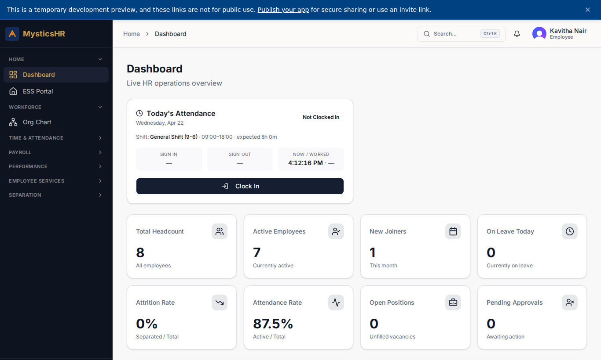
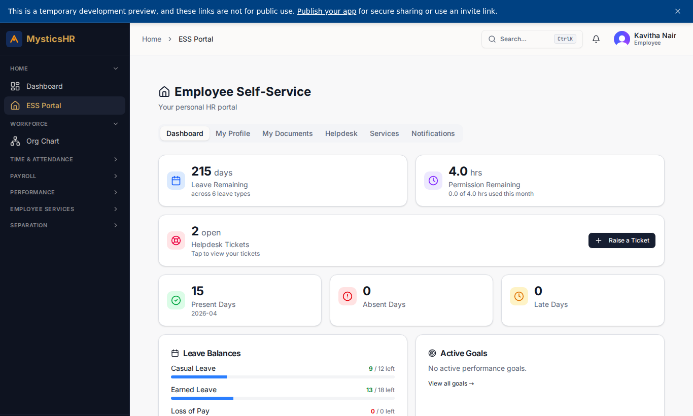
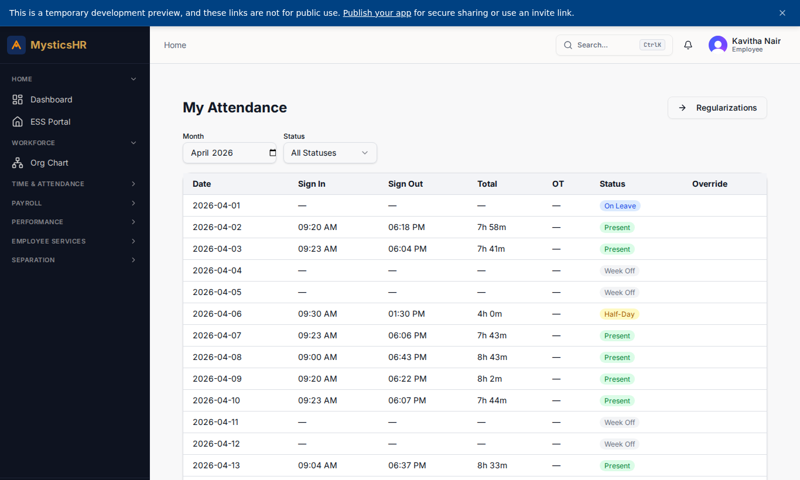
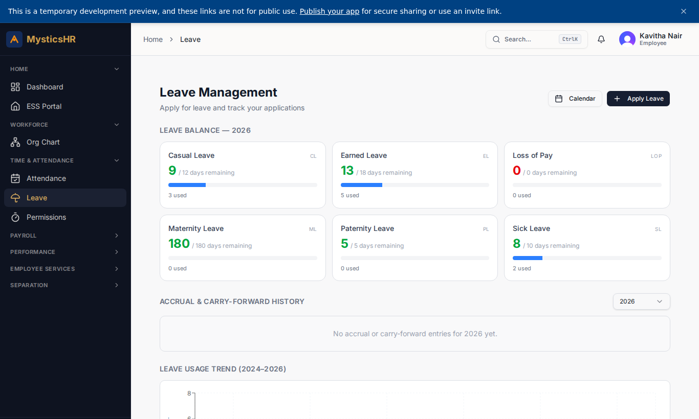
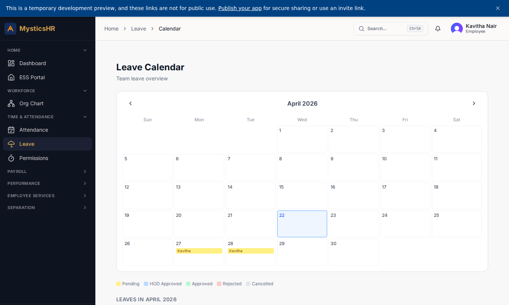
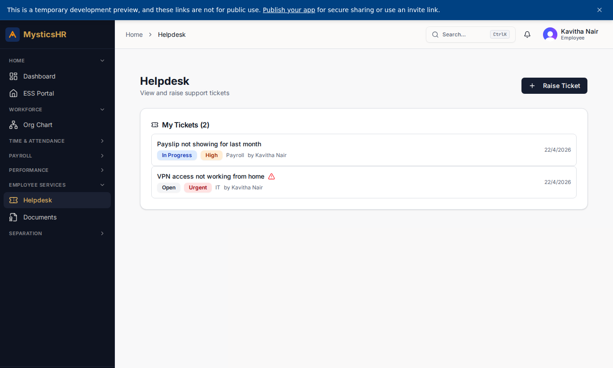
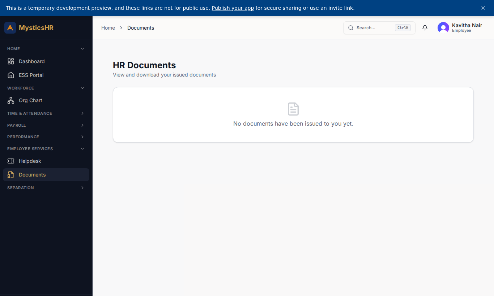

# Employee — ESS (Kavitha Nair) — Demo

**Sign-in:** `kavitha.n@automystics.com` · **Password:** `DemoTest123!@#`

Employee Self-Service. Marks attendance, applies for leave, sees payslips, raises helpdesk tickets, downloads documents.

---

## Screens this role sees

### Dashboard

Route: `/dashboard`

### ESS Hub

Route: `/ess`

### My Attendance

Route: `/my-attendance`

### My Leave

Route: `/leave`

### Leave Calendar

Route: `/leave/calendar`

### My Helpdesk Tickets

Route: `/helpdesk`

### My Documents

Route: `/documents`

---

## Suggested demo flow

1. Clock in from `/my-attendance`.
2. Apply for 2 days of casual leave at `/leave`.
3. Download the latest payslip and raise a helpdesk ticket from `/helpdesk`.
