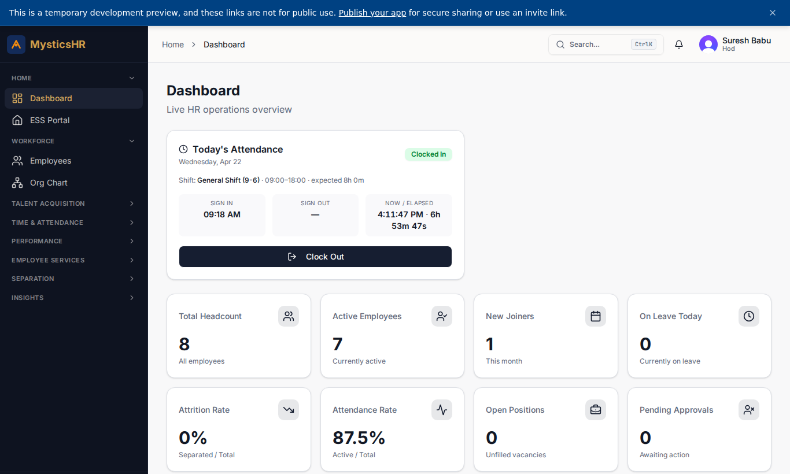
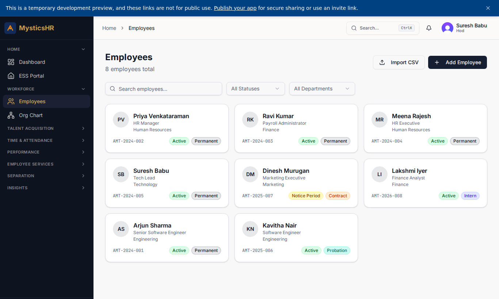
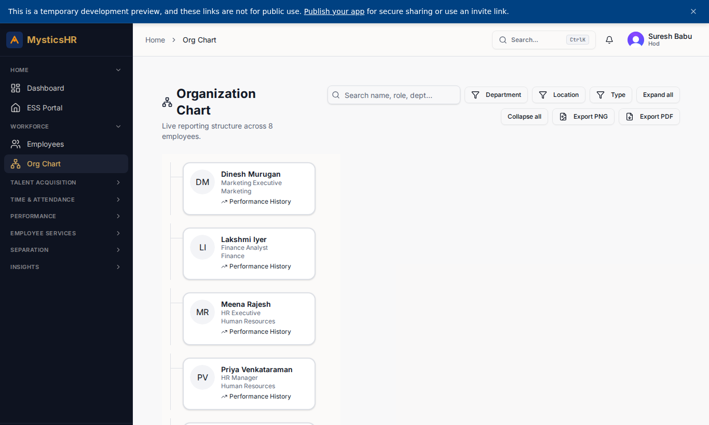
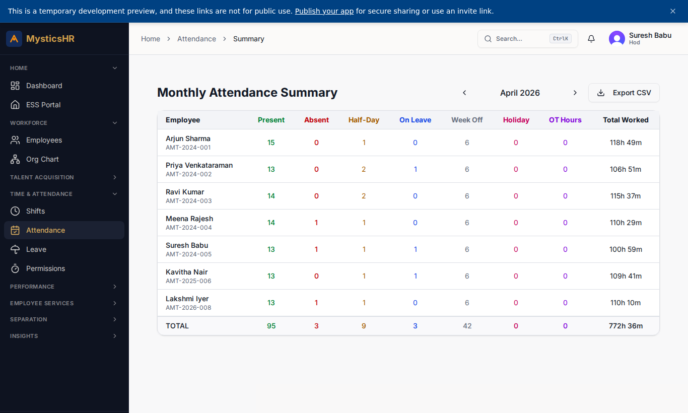
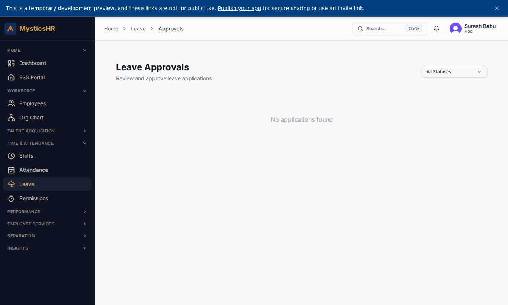
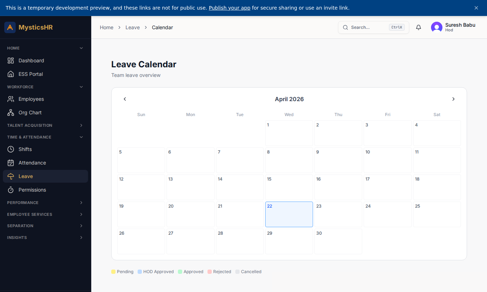
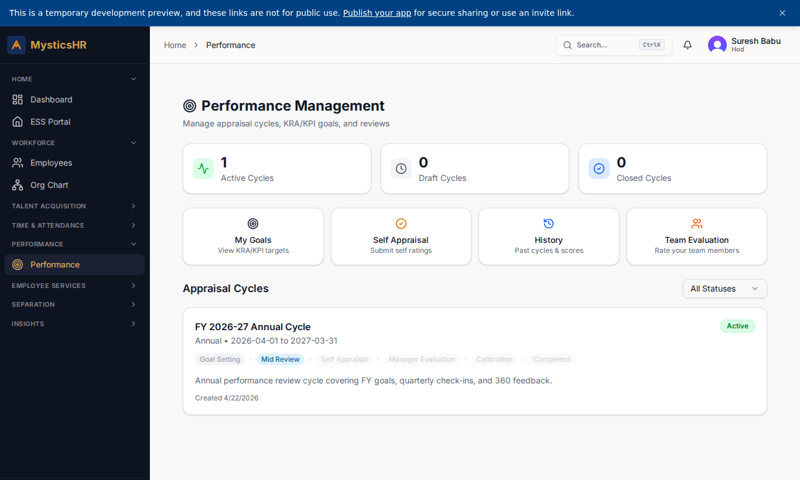
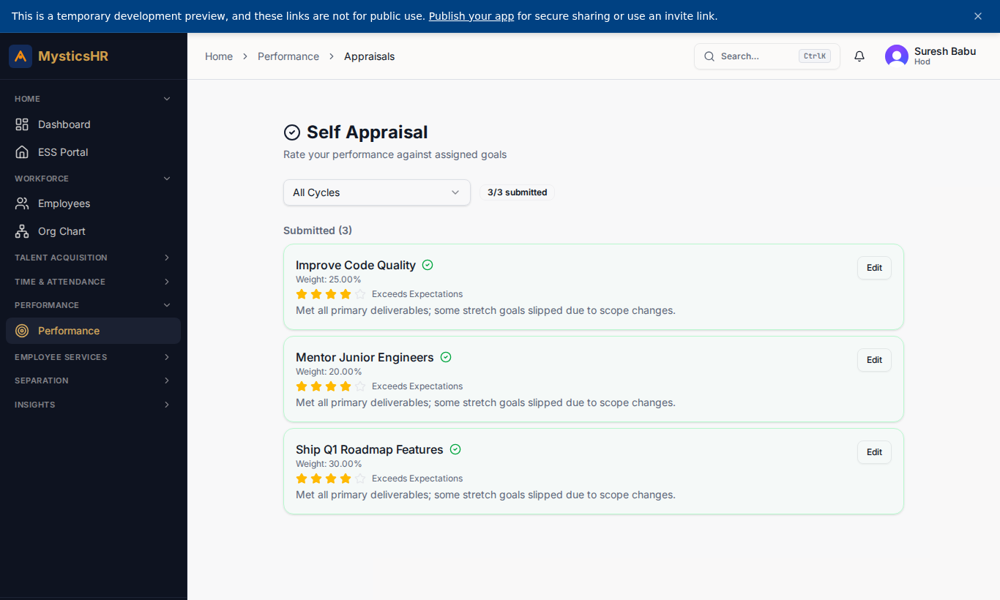

# HOD (Suresh Babu) — Demo

**Sign-in:** `suresh.b@automystics.com` · **Password:** `DemoTest123!@#`

Department head focused on the team: see team members, approve leave, run mid-year and annual evaluations, monitor attendance.

---

## Screens this role sees

### Dashboard

Route: `/dashboard`

### Team Members

Route: `/employees`

### Org Chart

Route: `/org-chart`

### Team Attendance Summary

Route: `/attendance/summary`

### Leave Approvals

Route: `/leave/approvals`

### Team Leave Calendar

Route: `/leave/calendar`

### Active Performance Cycle

Route: `/performance`

### Team Appraisals

Route: `/performance/appraisals`

---

## Suggested demo flow

1. Review the team via `/employees` (filtered to direct reports).
2. Approve a pending leave at `/leave/approvals`.
3. Submit a manager evaluation from `/performance/appraisals`.
