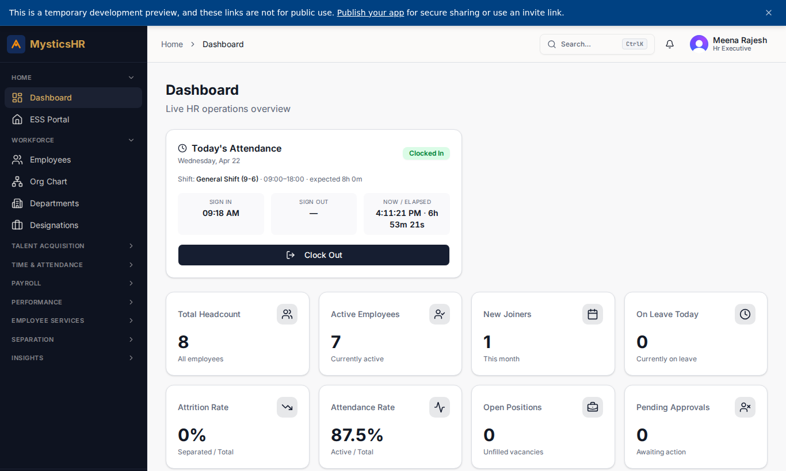
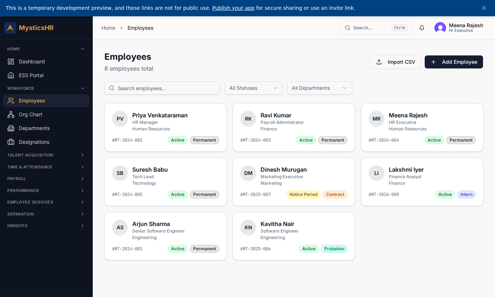
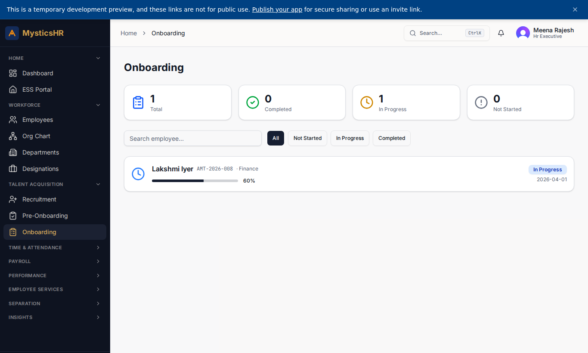
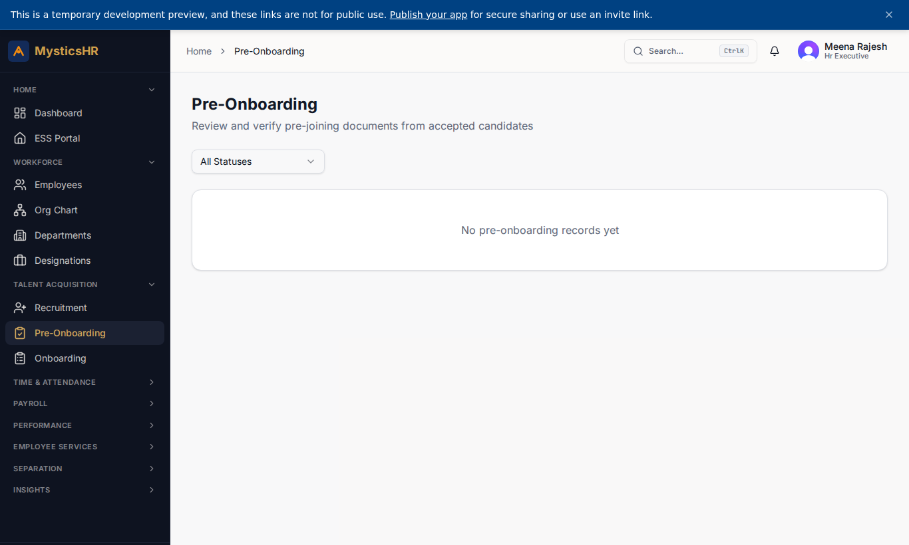
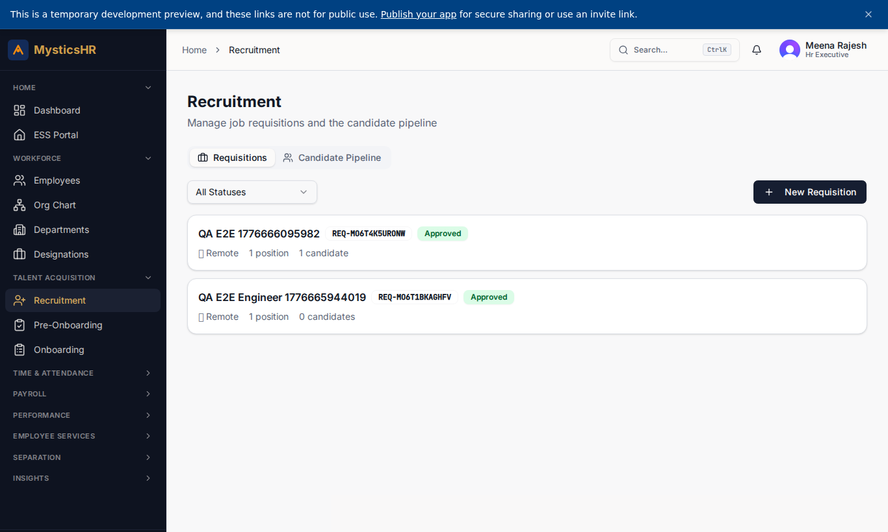
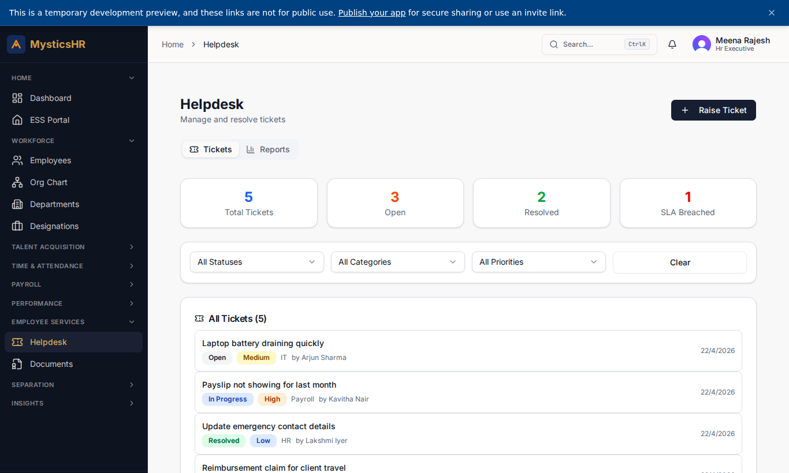
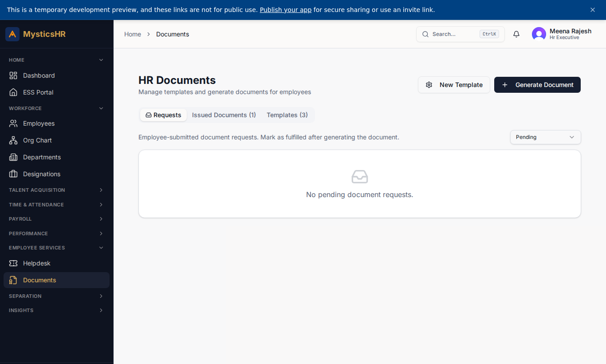

# HR Executive (Meena Rajesh) — Demo

**Sign-in:** `meena.r@automystics.com` · **Password:** `DemoTest123!@#`

Day-to-day HR operations: onboarding tasks, candidate coordination, helpdesk first-response, document issuance.

---

## Screens this role sees

### Dashboard

Route: `/dashboard`

### Employee Directory (read)

Route: `/employees`

### Onboarding Pipeline

Route: `/onboarding`

### Pre-onboarding

Route: `/pre-onboarding`

### Recruitment

Route: `/recruitment`

### Helpdesk Tickets

Route: `/helpdesk`

### Documents

Route: `/documents`

---

## Suggested demo flow

1. Move an onboarding task to Done from `/onboarding` for the latest joiner.
2. Pick a ticket from `/helpdesk`, add a comment, change status to In Progress.
3. Issue an Experience Letter from `/documents`.
