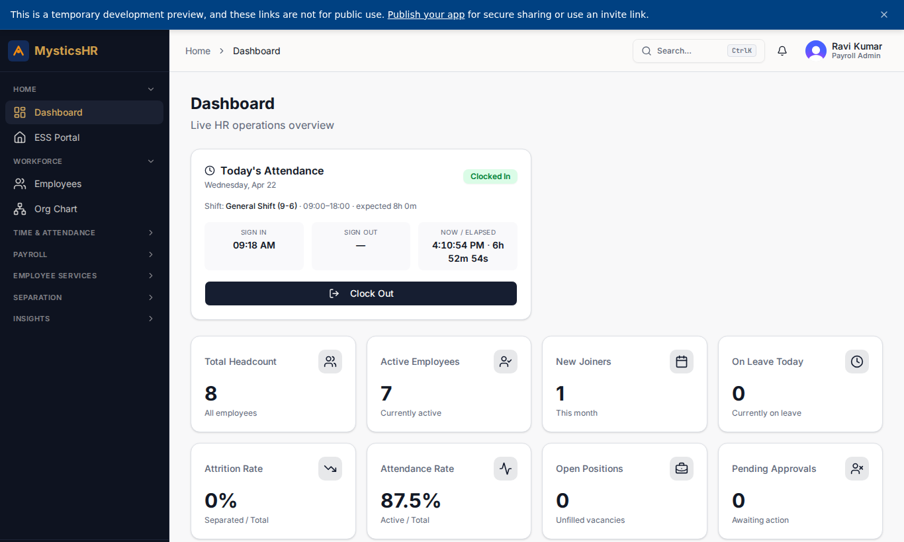
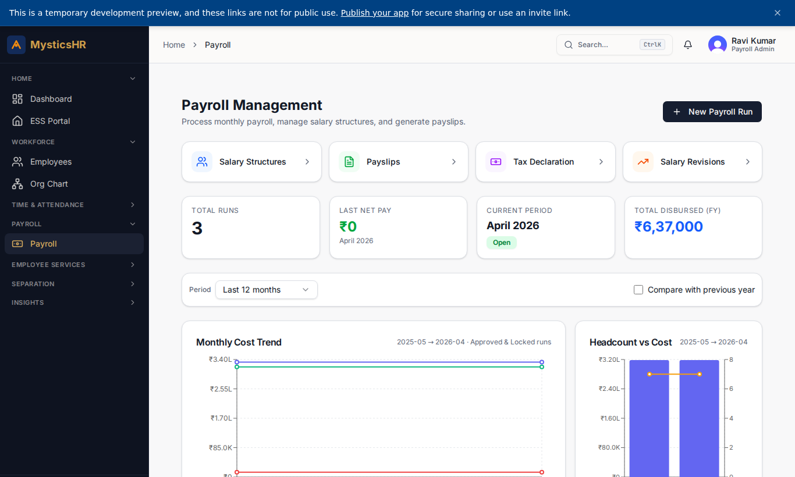
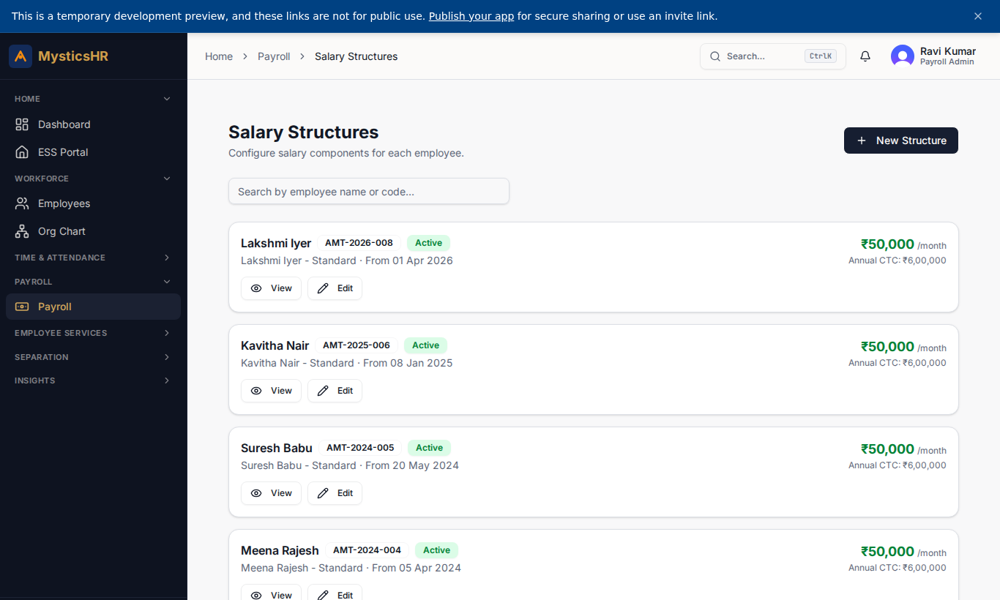
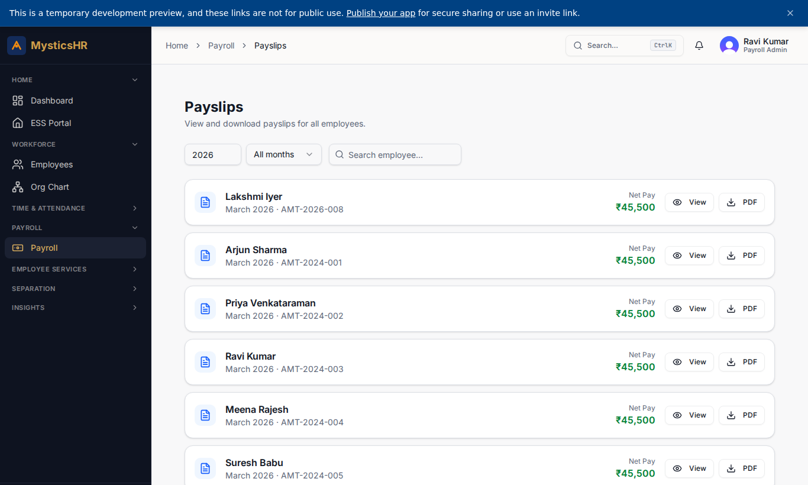
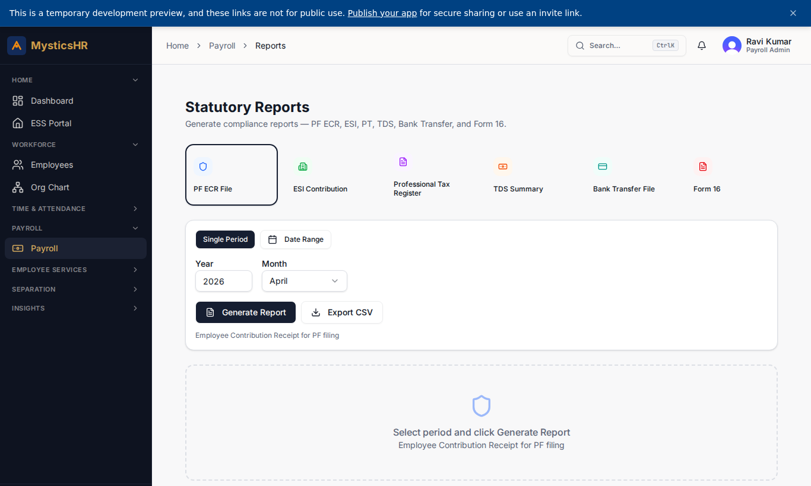
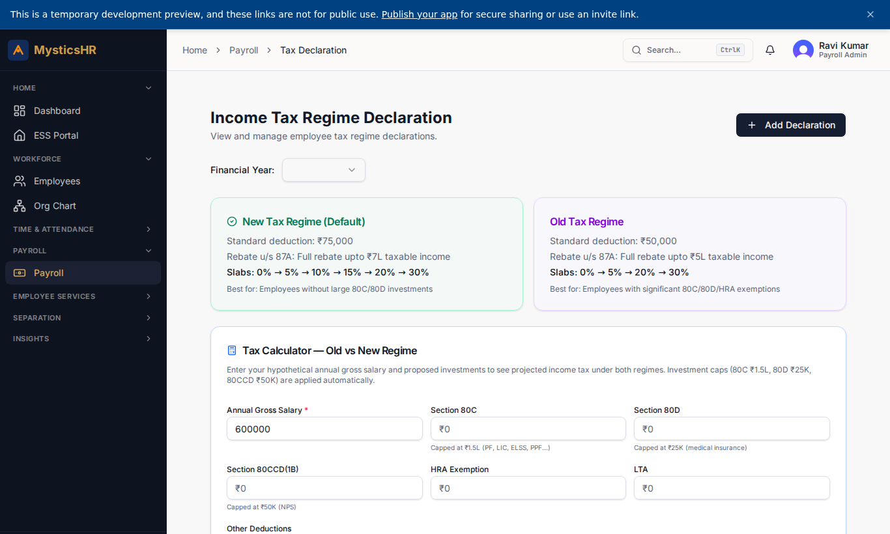
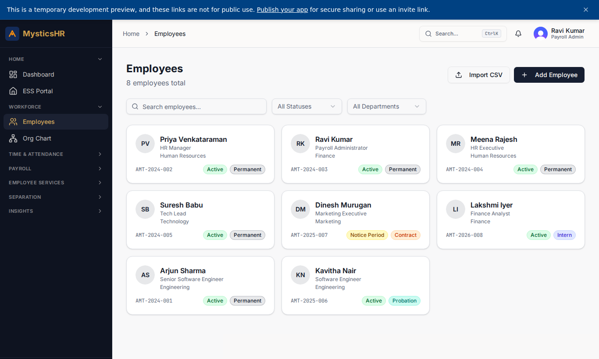

# Payroll Admin (Ravi Kumar) — Demo

**Sign-in:** `ravi.kumar@automystics.com` · **Password:** `DemoTest123!@#`

Owns payroll execution end-to-end: salary structures, monthly runs, payslips, statutory reports, and tax declarations.

---

## Screens this role sees

### Dashboard

Route: `/dashboard`

### Payroll Runs

Route: `/payroll`

### Salary Structures

Route: `/payroll/salary-structures`

### Payslips

Route: `/payroll/payslips`

### Payroll Reports

Route: `/payroll/reports`

### Tax Declarations

Route: `/payroll/tax-declaration`

### Employee Directory (read)

Route: `/employees`

---

## Suggested demo flow

1. Open the draft run at `/payroll`, click Calculate, then Lock.
2. Drill into a payslip from `/payroll/payslips` and download it.
3. Show statutory outputs at `/payroll/reports` and tax declarations at `/payroll/tax-declaration`.
