# Super Admin (Arjun Sharma) — Demo

**Sign-in:** `arjun.sharma@automystics.com` · **Password:** `DemoTest123!@#`

Has access to every module. Use this account for full-system demos, configuration walkthroughs, and audit reviews.

---

## Screens this role sees

### Dashboard

Route: `/dashboard`

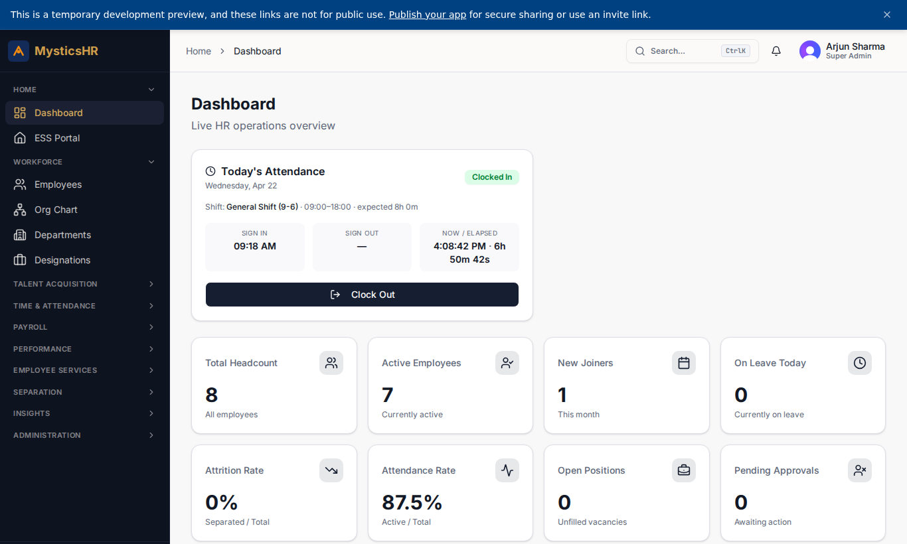

### Employee Directory

Route: `/employees`

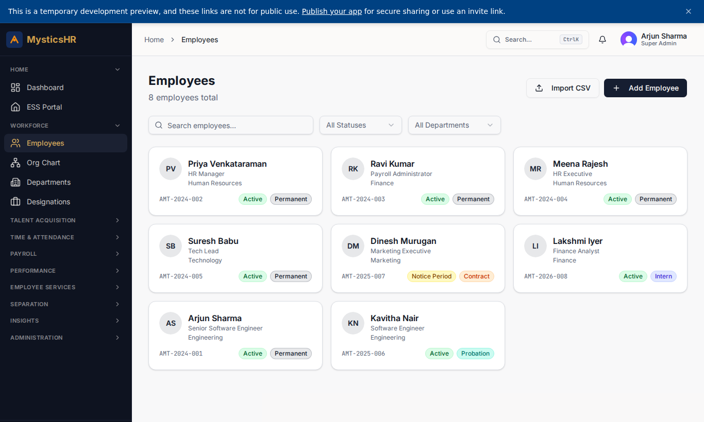

### Departments

Route: `/departments`

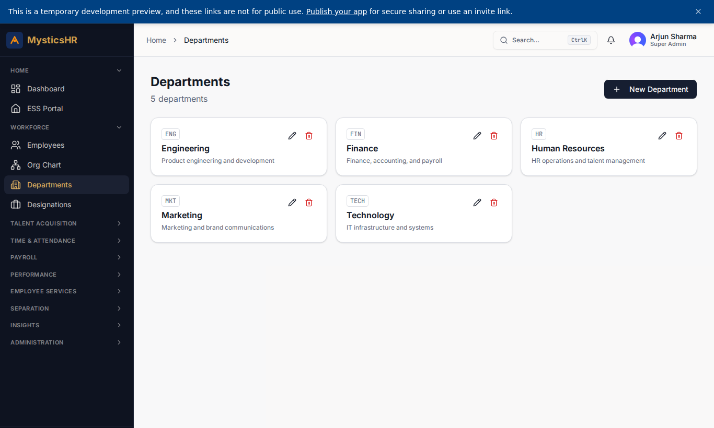

### Designations

Route: `/designations`

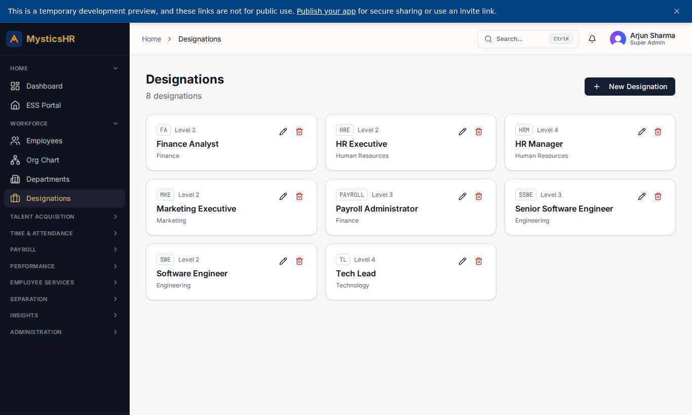

### Org Chart

Route: `/org-chart`

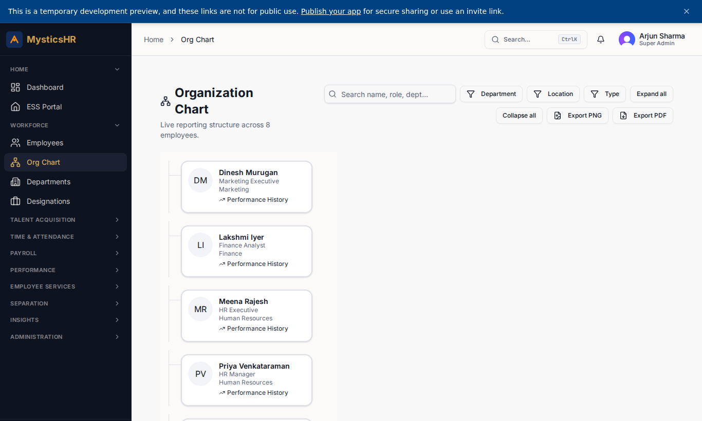

### Payroll Runs

Route: `/payroll`

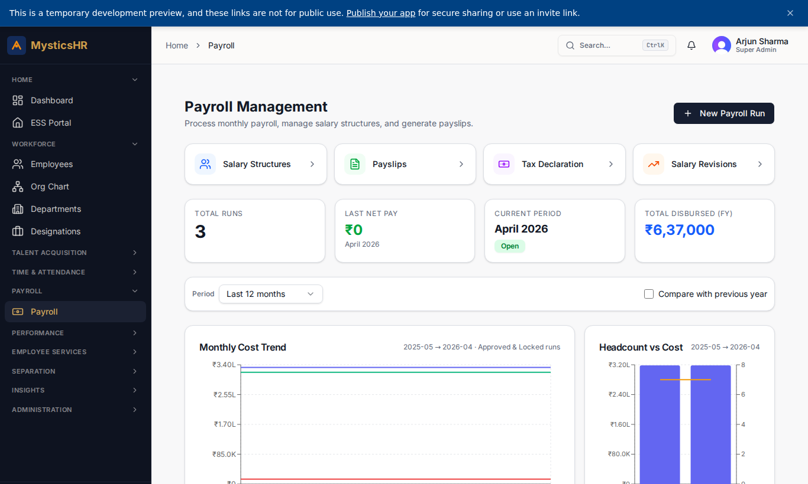

### Performance Cycles

Route: `/performance`

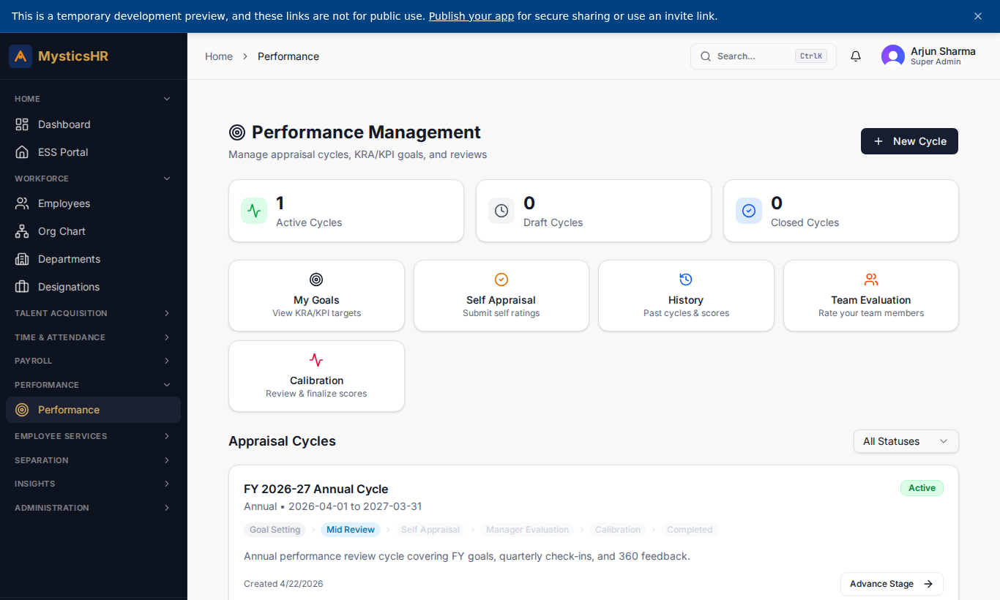

### User Management

Route: `/users`

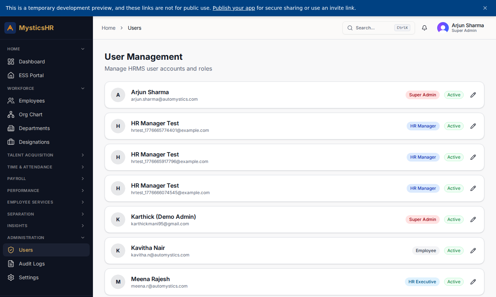

### Role Permissions

Route: `/permissions`

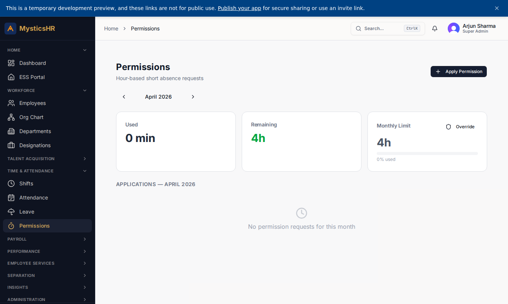

### Audit Log

Route: `/audit-logs`

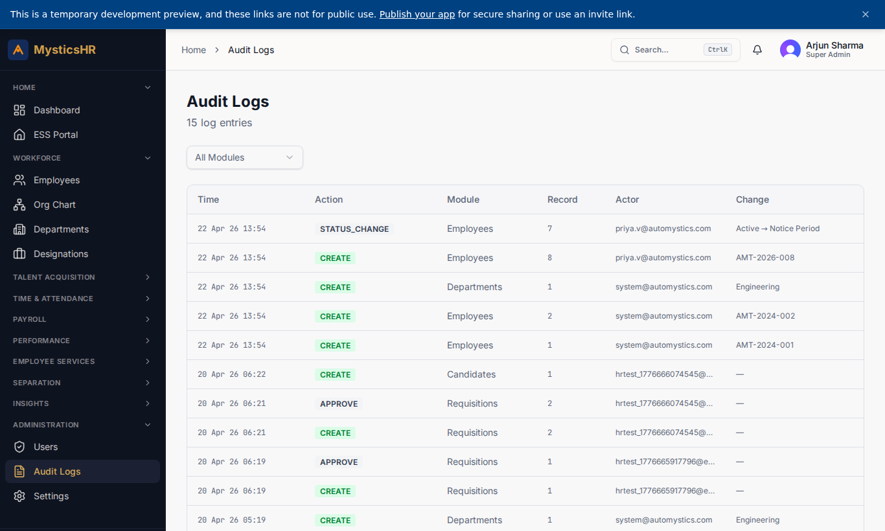

### System Settings

Route: `/settings`

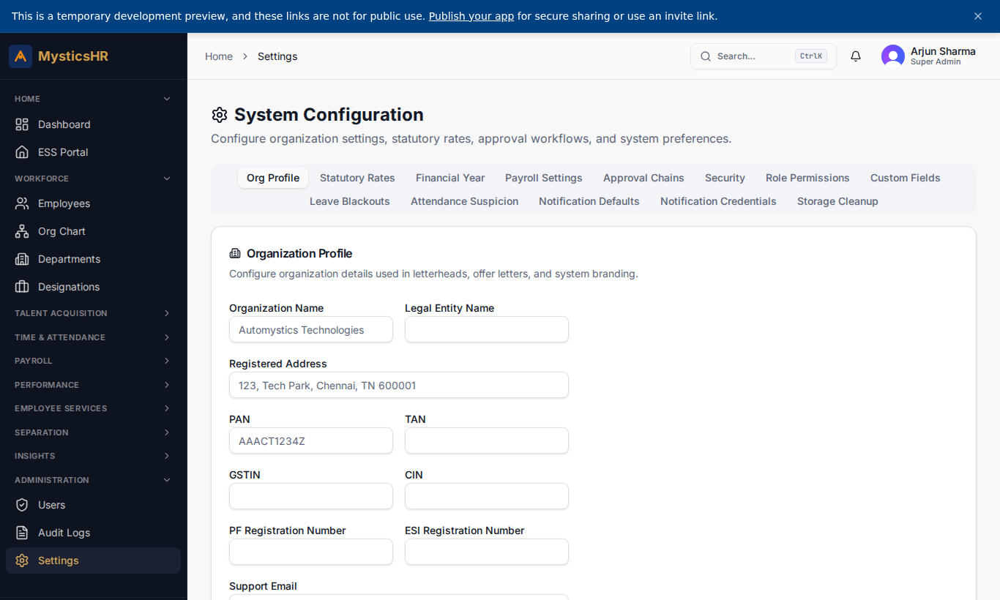

### Analytics

Route: `/analytics`

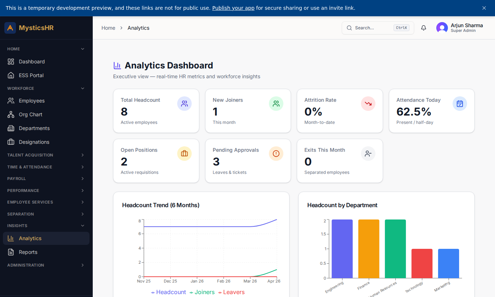

---

## Suggested demo flow

1. Tour the dashboard, then `/users` and `/permissions` to show the role matrix.
2. Open `/audit-logs` and walk through who-changed-what for the latest payroll run.
3. Step into `/settings` to review organisation-wide configuration.
